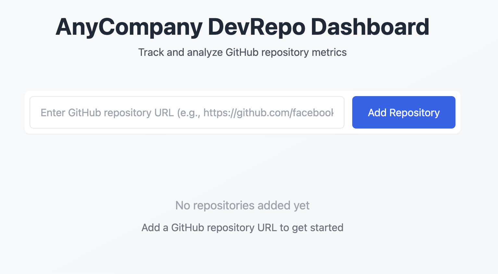

# GitHubMetrics - now on Supabase!

This project was bootstrapped with [Create React App](https://github.com/facebook/create-react-app).



## Overview

GitHubMetrics is a web application that allows users to track and analyze GitHub repository metrics. The application provides a simple and intuitive interface for:

- Adding GitHub repositories via their URLs
- Displaying repository information including:
  - Repository name
  - Main programming language
  - Date added to tracking
- Real-time status updates and error handling
- Responsive grid layout for multiple repository cards

### Technical Stack

The frontend is built with:
- React.js for the UI components and state management
- Supabase for backend database and authentication
- Tailwind CSS for styling and responsive design
- Environment variables for configuration

### Features

- **Repository Management**: Users can add new repositories by entering their GitHub URLs
- **Real-time Updates**: The UI updates automatically when repositories are added
- **Error Handling**: Clear error messages for failed operations
- **Responsive Design**: Adapts seamlessly to different screen sizes
- **Modern UI**: Clean and intuitive interface with hover effects and loading states

### Supabase Integration

The application uses Supabase as the backend service that:
- Provides a PostgreSQL database for storing repository data
- Handles authentication (when enabled)
- Provides real-time updates

The Supabase connection is configured via environment variables:
- `REACT_APP_SUPABASE_URL`: Your Supabase project URL
- `REACT_APP_SUPABASE_ANON_KEY`: Your Supabase anonymous key

## Supabase Setup

Follow these steps to set up the Supabase backend for this application:

1. **Create a Supabase Account and Project**:
   - Go to [Supabase](https://supabase.com/) and sign up for an account
   - Create a new project and note your project URL and anon key

2. **Set Up Database Table**:
   - In your Supabase dashboard, go to the SQL Editor
   - Create the `repos` table by running the following SQL:

```sql
CREATE TABLE repos (
  id SERIAL PRIMARY KEY,
  name TEXT NOT NULL,
  owner TEXT NOT NULL,
  fullName TEXT NOT NULL,
  stars INTEGER NOT NULL DEFAULT 0,
  forks INTEGER NOT NULL DEFAULT 0,
  issues INTEGER NOT NULL DEFAULT 0,
  mainLanguage TEXT,
  healthScore INTEGER NOT NULL DEFAULT 0,
  activityLevel TEXT,
  trendingFactor INTEGER NOT NULL DEFAULT 0,
  createdAt TIMESTAMP WITH TIME ZONE DEFAULT NOW()
);
```

3. **Configure Environment Variables**:
   - Create a `.env` file in the root of your project
   - Add the following variables:

```
REACT_APP_SUPABASE_URL=your_supabase_project_url
REACT_APP_SUPABASE_ANON_KEY=your_supabase_anon_key
```

4. **Set Up Table Permissions**:
   - Go to Authentication > Policies in your Supabase dashboard
   - Configure Row Level Security (RLS) for the `repos` table based on your access requirements
   - For a simple setup, you can enable anonymous access with the following policy:

```sql
CREATE POLICY "Allow anonymous access" ON repos
FOR ALL
TO anon
USING (true);
```

## Available Scripts

In the project directory, you can run:

### `npm start`
Runs the app in development mode at [http://localhost:3000](http://localhost:3000)

### `npm test`
Launches the test runner in interactive watch mode

### `npm run build`
Builds the app for production in the `build` folder

### `npm run eject`
⚠️ **One-way operation** - Ejects from Create React App to expose all configs